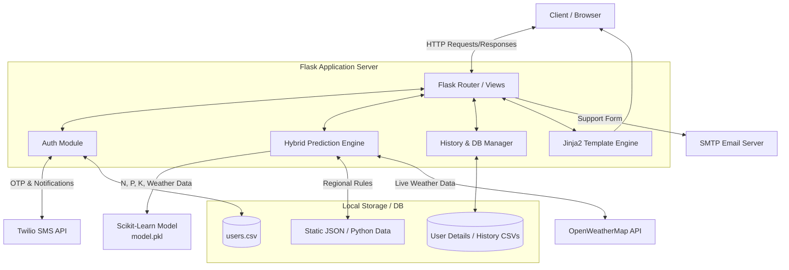

# Kisan Suvidha - System Design Document

## 1. Overview
**Kisan Suvidha** is a comprehensive agricultural support web application designed to help farmers make informed decisions about which crops to plant. It provides highly accurate crop recommendations and feasibility analysis by leveraging a **Hybrid Prediction Engine** that combines a Machine Learning model with regional heuristics (soil type, season, and geographical location). The platform also supports multi-language access (English & Hindi) and SMS notifications.

---

## 2. System Architecture

The application follows a monolithic architecture built around the Flask framework.



---

## 3. Technology Stack

### Frontend
- **HTML5, CSS3, JavaScript**: Standard web technologies for the user interface.
- **Jinja2**: Templating engine for rendering dynamic HTML pages directly from Flask.

### Backend
- **Python**: Core programming language.
- **Flask**: Lightweight web framework handling routing, session management, and API endpoints.

### Machine Learning
- **Scikit-Learn / Numpy**: Used for predictive modeling. The application utilizes a pre-trained model (`model.pkl`) trained on `Crop_recommendation.csv`.

### Database
- **CSV-based File System**: 
  - `users.csv`: Stores user credentials (phone, hashed password, state, district).
  - `/user details/`: Directory containing individual CSV files (e.g., `phone.csv`) to store the historical logs of recommendations and analyses.
- **JSON files**: `crop_conditions.json`, `seasonal_rainfall.json`, `state_crops.json`, etc., acting as static document stores.

### Third-Party Services
- **Twilio**: Used for OTP generation during user registration and sending SMS notifications for crop recommendations and analysis.
- **OpenWeatherMap**: Fetches live weather conditions (temperature, humidity, rainfall) for a specific district.
- **Flask-Mail / SMTP (Gmail)**: Facilitates the customer support portal.

---

## 4. Core Components

### 4.1 Hybrid Prediction Engine
Instead of relying solely on an ML model which might predict crops unsuited for a specific region, the app uses a **hybrid approach**:
1. It passes Soil nutrients (N, P, K, pH) and Weather (Temp, Humidity, Rainfall) to the **ML Model**.
2. It cross-references the ML output against **Regional Rules** (`state`, `season`, `soil type`).
3. If the ML output violates regional heuristics (e.g., Apple in Rajasthan), it falls back to a rule-based algorithm (`pick_best_from_rules`) to suggest a more feasible crop, along with "High/Medium/Low" confidence scores and localized alternatives.

### 4.2 Authentication & User Management
- Users register using their Name, 10-digit Mobile Number, State, District, and Password.
- **OTP Verification**: A 6-digit OTP is generated and sent via Twilio to verify the mobile number during sign-up.
- Passwords and user profiles are stored in `users.csv`.

### 4.3 Multilingual Support System
- The entire application features built-in translations for Hindi and English.
- Dictionaries mapping states, districts, crop names, and system messages are maintained (e.g., `STATES_HINDI`, `CROP_HINDI_NAMES`).
- The user's preferred language is stored in the Flask session.

### 4.4 History and Tracking Engine
- Every recommendation or analysis requested by a user is logged to a specific CSV file `user details/{mobile}.csv`.
- This enables a "History" view where users can revisit their past queries.

---

## 5. Data Flow: Crop Recommendation

1. **User Request**: The logged-in user selects a soil type and season, then submits the form.
2. **Context Assembly**: The system retrieves the user's `district` and `state` from their session.
3. **Weather Fetching**: `get_weather_details()` calls the OpenWeatherMap API to get live temperature, humidity, and rainfall for the district. If the API fails, it defaults to historical seasonal averages.
4. **Prediction**: The `run_smart_prediction()` function feeds the data into the ML model (`model.pkl`) to get a primary prediction.
5. **Heuristic Validation**: The ML prediction is validated against the static datasets (`state_crops.json`, `seasonal_rainfall.json`). Confidence is calculated.
6. **Response Preparation**: The system generates Hindi/English reasoning, calculates irrigation requirements, and finds alternatives.
7. **Notification & Storage**: 
   - An SMS is sent to the user (via Twilio) with the recommendation.
   - The result is appended to the user's history CSV.
8. **View Render**: The user is presented with the `status.html` page showing detailed metrics.

---

## 6. Directory Structure Overview

```text
KisaanSuvida/
│
├── app.py                      # Main Flask application and business logic
├── crop_data.py                # Data dictionaries, rules, and helper functions
├── trained_model.py            # Script used to generate model.pkl
├── model.pkl                   # Pre-trained Scikit-Learn crop recommendation model
│
├── users.csv                   # Global user credentials database
├── user details/               # Directory storing individual user history (e.g., 9876543210.csv)
│
├── templates/                  # Jinja2 HTML templates
│   ├── login.html              # Login & Signup interfaces
│   ├── crop.html               # Form for crop recommendation
│   ├── analysis.html           # Form for crop suitability analysis
│   ├── status.html             # Recommendation results view
│   ├── history.html            # User activity log
│   └── ...
│
├── database/                   # Potentially old or alternative DB references
└── *.json / *.csv              # Static knowledge bases (rainfall, state_crops, etc.)
```

---

## 7. Limitations and Future Improvements

1. **Database Migration**: Currently, the system uses CSV files (`users.csv`, `/user details/*.csv`) for data storage. As the user base grows, this will cause concurrency issues and slow read/write speeds. **Recommendation**: Migrate to an RDBMS like PostgreSQL or MySQL using SQLAlchemy.
2. **Security**: Passwords are currently passed into a `hash_password` function that (as implemented) just returns the plaintext password. **Recommendation**: Implement `bcrypt` or `Werkzeug.security` for proper password hashing.
3. **API Keys**: Keys for Twilio, OpenWeatherMap, and SMTP are currently hardcoded in `app.py`. **Recommendation**: Move these to a `.env` file and use `python-dotenv` to load them securely.
4. **Error Handling & Retries**: Add robust retry logic for external API calls (Twilio and OpenWeather) to handle temporary network failures gracefully.
